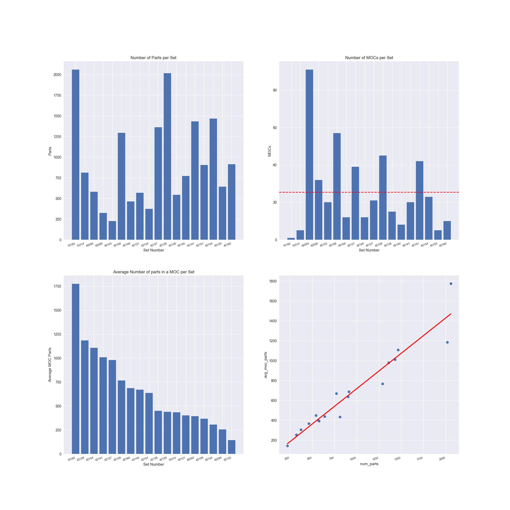

# Lego Data Loader

An app for batch loading information about Lego sets and the MOCs ("My Own Creation") of those sets. 

## Description

Uses Rebrickable and Brickset APIs.
Takes a .csv file containing Lego set numbers as input.
Creates a .csv file containing info about the Lego sets. Also creates separate .csv files for listing the MOCs of every set. 
Finally creates a .png file containing some plots derived from the gathered data.

## Getting Started

You will need API keys to the following:
* Rebrickable
* Brickset

You will need to create a [keys.py](keys.py) file with the following content:
```
APIKEY_REBRICK = "YOUR-API-KEY"
APIKEY_BRICKSET = "YOUR-API-KEY"
```

Input: [my_lego_sets.csv](my_lego_sets.csv)

Output: lego_info.csv, lego_plots.png and for every set {SET_NUMBER}-MOCs.csv

## Sample Output




## Development Plans
* Enable controlling the program with user input.
* Improve the cleaning of the MOC data